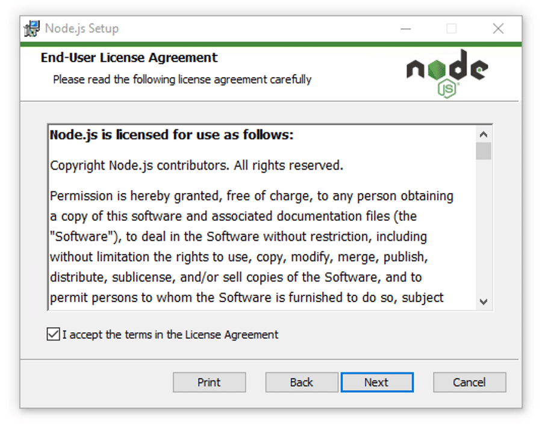
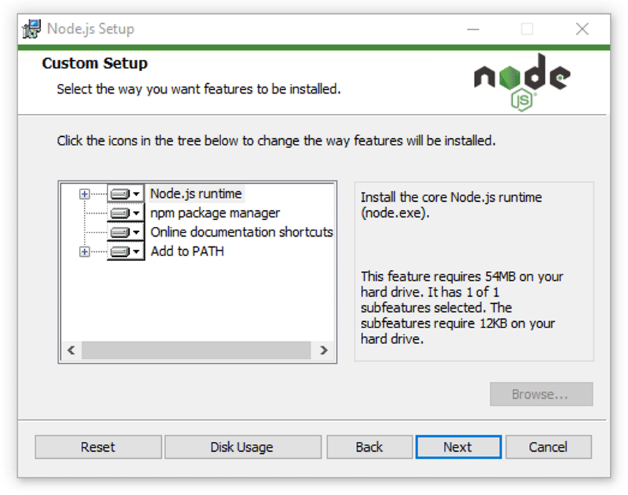
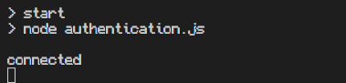
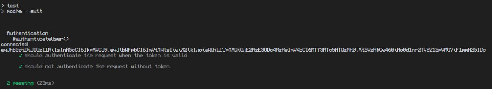

# T8 Project
 
>status: the development of the project has stopped for now and there are no plans to continue it in the future

## Dentistimo Security
This is the security component of group eights [Dentistimo](https://git.chalmers.se/courses/dit355/dit356-2022/t-8/documentation) system. Dentistimo is a distributed system which allows users to book dentist appointments in the Gothenburg region and allows for more clinics to be added in the future. This repository contains the security component which is responsible for authenticating messages sent by other components of the system. This is done through the use of [MQTT](https://mqtt.org/) and [jsonwebtoken](https://jwt.io/). Messages which have not been checked by this component are recieved through mqtt and then, if the message has a token inside it, it checks the authenticity of the message. If the message has a valid token, it is sent to the backend. If the message does not have a valid token, it is sent back to the source with an error message. The security component provides the following functionalities:
 
- receive mqtt messages with the topic "unauthenticated"
- parse mqtt messages
- verify jsonwebtoken
- retrieve user data from a jsonwebtoken
- publish mqtt messages
- handle no token error
- handle invalid token error
- Change authentication status of a request

## Installation
In order to run the component you need to have the project on your computer, node.js installed and mosquito installed.
- The first step is installing [node.js](https://nodejs.org/en/download/), what version you should download depends on your operating system (this guide will show the process for windows, if you're using mac or linux you can check out [this](https://kinsta.com/blog/how-to-install-node-js/) guide which explains that process as well)
  - Double click the .msi file in order to begin the installation process
 
&nbsp;
&nbsp;
 

 
*Click on next.*
 
&nbsp;
 

 
*select the destination where you want to install Node.js. If you don’t want to change the directory, go with the Windows default location and click the Next button again.*
 
&nbsp;
 

 
*If you want a standard installation with the Node.js default features, click the Next button. Otherwise, you can select your specific elements from the icons in the tree before clicking Next.*
 
&nbsp;
 

 
*Node.js offers you options to install tools for native modules. If you’re interested in these, click the checkbox to mark your preferences, or click Next to move forward with the default.*
 
&nbsp;
 

 
*Click install, this can take a couple of minutes*
 
&nbsp;
 
  - Once you have finished the installation you can verify it by opening the [CMD](https://www.lifewire.com/command-prompt-2625840) and typing:
 
  >```node --version```
 
  - You can also check npm by typing:
 
  >```npm --version```
 
  If node has been correctly installed you should see the version name in the CMD prompt
 
&nbsp;

- The next step is to download the project .zip file or pull the project with [git](https://git-scm.com/), if you have that installed.
 
- Extract the project files from the .zip and put them in a place you can easily find, example:
  >C:\Users\name\Desktop\security
 
- open the [CMD](https://www.lifewire.com/command-prompt-2625840) and go to the directory where you put the files. This can be done by typing cd + the file path. If I put my files in C:\Users\name\Desktop\security I would type:
  >cd C:\Users\name\Desktop\security

- Type:
  >npm install
 
- Once all dependencies have been installed, type the command
  >npm start
 
If everything is installed correctly and running as it should you should see something like this
 
 

## Usage
The main use of the security is to be a safety net which checks if the client has a token when sending requests. Since we are using a jsonwebtoken library for the token, we can easily decode the token by doing

 ```js
 const decoded = jwt.verify(req.token, process.env.JWT_KEY);
 ```

 Here we use the JWT_KEY which needs to be the same as the one used to encrypt the data. The key can be found in nodemon.json. The security component is not very flexible and needs to recieve the token in a very specific format. That format should be 

 ```JSON
 {
  request: "request",
  url: "url",
  data: {
    token: "token"
  },
  authenticated: false
 }
 ```

The only important thing to note here is the location of the "token" and authenticated since they are the only ones involved in the security process. If the token is valid then the authenticated will be changed to true and the requestcan then pass the [middleware](https://git.chalmers.se/courses/dit355/dit356-2022/t-8/t8-project) to the [backend](https://git.chalmers.se/courses/dit355/dit356-2022/t-8/data-manager). This means that as long as token and authentiated are preserved, the rest of the request can be changed to a very hight degree. Adding and removing elements can easily be done to suite the needs of the system. 

## Support
If you encounter any issues with the security component, we recomend checking that mqtt is working as it should first since this is usualy the problem. If mqtt is working as it should then you can also try running the tests, this is done by typing `npm test` in the [CMD](https://www.lifewire.com/command-prompt-2625840). If everything is okay then it should look something like this:



If neither of those things appear to be the issue you are free to contact us at [this](mailto:djcoetzer10@gmail.com) email.

## Contributing
We are for the moment not open to contributions.

## Authors and acknowledgment
@coetzer
 
@ayvazian
 
@yasaminf
 
@dunvald
 
@aminmah
 
@samcenko
 
@shatskyi

## License
[](https://opensource.org/licenses/MIT)
